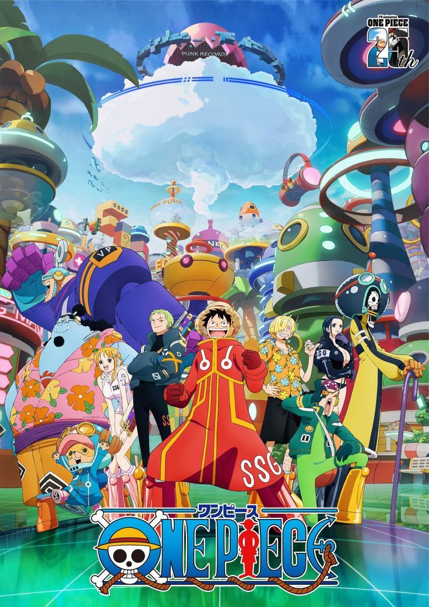
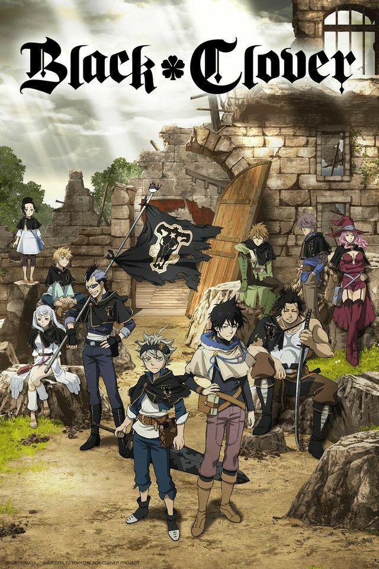
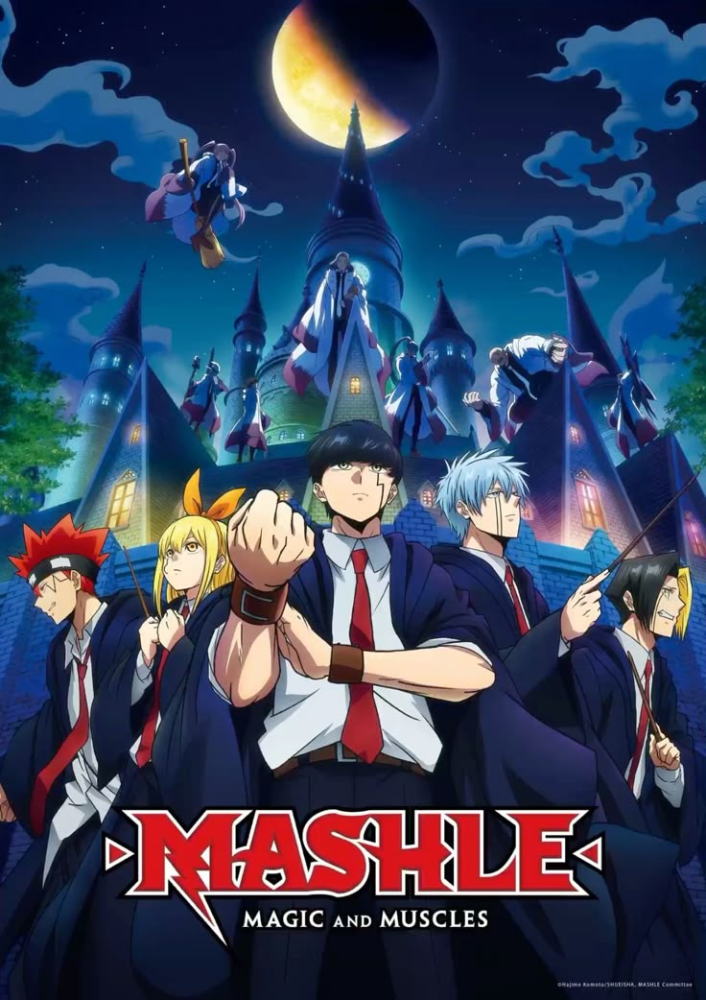
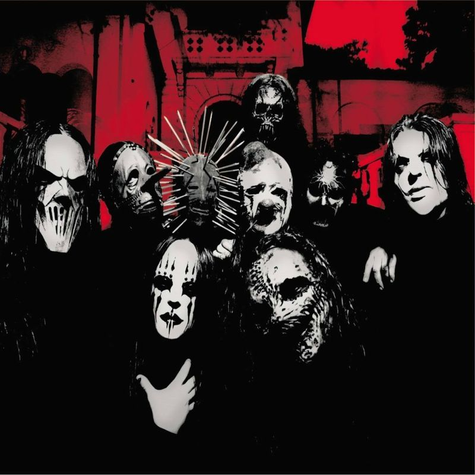

---

# Ryanderson Henzyo Souza e Moura
> A verdadeira arte é apenas o reflexo dos sentimentos de quem a contempla.
>
>Rafael Lange

- Técnico em Informática

Finalizando o curso técnico em Informática integrado ao ensino médio no IFNMG - Campus Salinas.

## 👨‍💻 Sobre Mim

- 🧪 Atualmente trabalhando em um projeto de **Quimioinformática**, com Python utilizando a biblioteca **RDKit**, no [Lab de Química Computacional do IFNMG](https://github.com/Lab-de-Quimica-Computacional-do-IFNMG).
- 🌐 Desenvolvendo um site institucional com viés acadêmico, na disciplina de Desenvolvimento Web do curso técnico. Com o tema [Site Institucional do Restaurante Dona Cida](https://github.com/Samuel007b/tf-web-tema)
- 🎮 Desenvolvo jogos como hobby, utilizando Java, Scratch, GDScript (Godot Engine) e C.
- 🎬 Também curto editar vídeos e fazer design gráfico — ainda em nível iniciante/médio.
- 🎲 Mestre de RPG nas horas vagas.
- 🎨 Amo todas as artes.
- 🎓 Finalizando o curso técnico em Informática pelo IFNMG - Campus Salinas.

---

### ⭐ Meus Favoritos

<table>
<tr>
<td valign="top" width="25%">

**🎬 Animes**

 One Piece  
 Black Clover  
 Mashle: Magic and Muscles

</td>
<td valign="top" width="25%">

**🎮 Jogos**

 Hades  
 Skul: The Hero Slayer  
 Call of Juarez: Gunslinger

</td>
<td valign="top" width="25%">

**🦸 Personagens**

 Anakin Skywalker  
 Roronoa Zoro  
 Homem-Aranha

</td>
<td valign="top" width="25%">

**🎧 Músicas**

 A Man Without Love  
 Before I Forget — Slipknot  
 Duality — Slipknot  
 Sugar — System of a Down

</td>
</tr>
</table>

---

---

### 🛠️ Tecnologias e Ferramentas

---

### 🌐 Idiomas

- 🇬🇧 Inglês — Básico (em treinamento)
- 🇫🇷 Francês — Intermediário (em treinamento)
- 🇪🇸 Espanhol — Básico 

---

### 🔧 Outras habilidades

- Montagem e manutenção de computadores — nível intermediário/avançado
- Criador e Mestre de RPG's - Ordem Paranormal e Tormenta 20
- Editor de vídeos
- Designer gráfico

---

### 🎓 Cursos concluídos

- Algoritmos e Estrutura de Dados (Python e C)
- Desenvolvimento de Sistemas (Java)
- Montagem e Manutenção de Computadores
- Banco de Dados
- Análise e Projeto de Sistemas
- Software e Sistemas Operacionais

---

### 📫 Como me encontrar

---

### 📊 Estatísticas do GitHub

---

